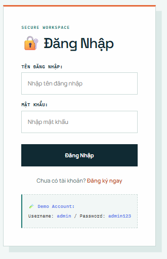
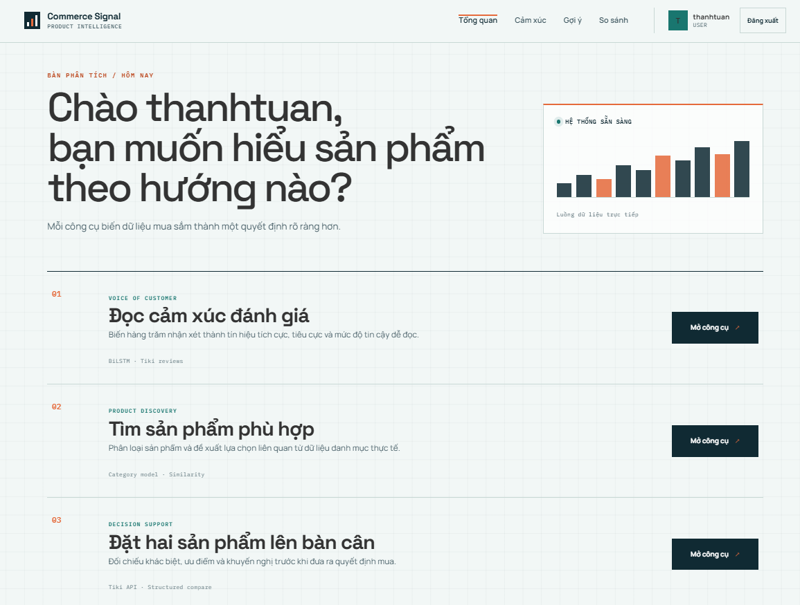
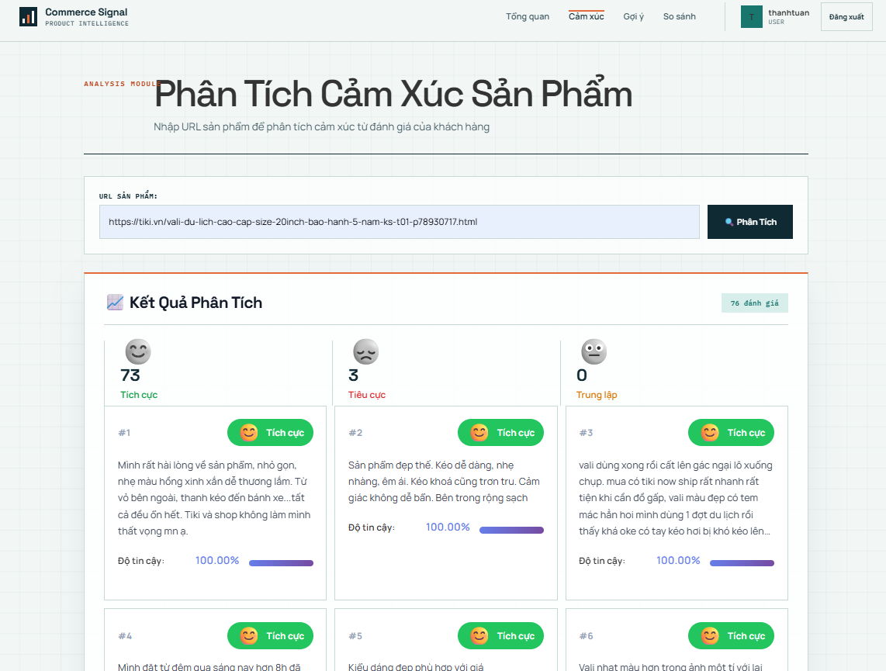
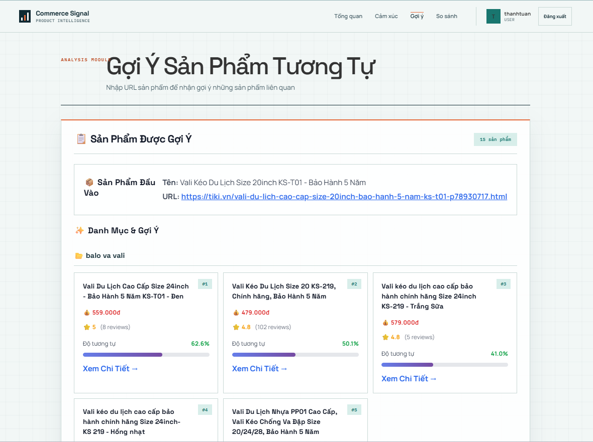
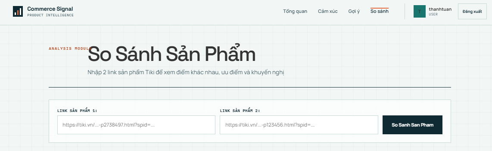
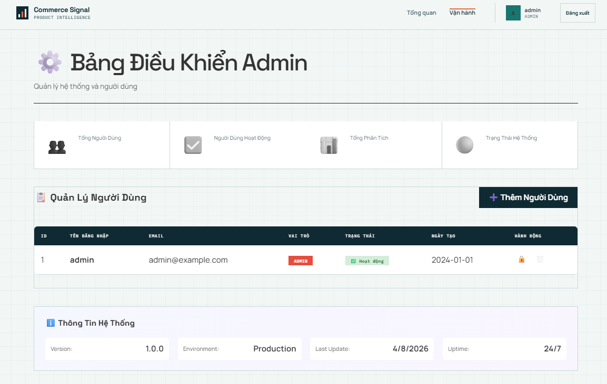

# Commerce Signal — Phân tích và hỗ trợ lựa chọn sản phẩm

Commerce Signal là ứng dụng web full-stack giúp người mua xử lý lượng lớn thông tin trên sàn thương mại điện tử trước khi đưa ra quyết định. Thay vì phải đọc thủ công hàng trăm đánh giá và mở nhiều trang sản phẩm để đối chiếu, người dùng chỉ cần cung cấp đường dẫn Tiki; hệ thống sẽ phân tích cảm xúc, nhận diện danh mục, đề xuất sản phẩm liên quan và hỗ trợ so sánh hai lựa chọn.

> Đồ án tập trung vào việc đưa các mô hình machine learning vào một luồng sản phẩm hoàn chỉnh: thu thập dữ liệu, suy luận bằng mô hình đã huấn luyện, cung cấp REST API và trình bày kết quả trên giao diện React.

## Bài toán dự án giải quyết

Người mua hàng trực tuyến thường gặp ba vấn đề:

- Có quá nhiều đánh giá, khó nhận biết cảm nhận chung về sản phẩm.
- Khó tìm các lựa chọn tương tự hoặc bổ trợ trong cùng nhóm nhu cầu.
- Thông số và ưu điểm của hai sản phẩm nằm rải rác, khó so sánh trực tiếp.

Commerce Signal gom những tác vụ đó vào một không gian làm việc thống nhất. Kết quả được trình bày theo hướng hỗ trợ quyết định, thay vì chỉ trả về dữ liệu hoặc xác suất thô từ mô hình.

## Chức năng

Dự án hiện có **6 nhóm chức năng**:

| # | Chức năng | Mô tả |
|---|---|---|
| 1 | Xác thực người dùng | Đăng ký, đăng nhập, mã hóa mật khẩu và cấp JWT theo vai trò `user`/`admin`. |
| 2 | Phân tích cảm xúc | Thu thập đánh giá từ link sản phẩm Tiki và phân loại từng đánh giá bằng mô hình BiLSTM. |
| 3 | Nhận diện danh mục | Dự đoán danh mục từ tên sản phẩm bằng mô hình phân loại đã huấn luyện. |
| 4 | Gợi ý sản phẩm | Kết hợp danh mục, TF-IDF và cosine similarity để tìm sản phẩm liên quan từ dữ liệu cục bộ. |
| 5 | So sánh hai sản phẩm | Tạo nguồn dữ liệu từ hai link Tiki, nhận kết quả so sánh có cấu trúc và hiển thị khác biệt, ưu điểm, khuyến nghị. Luồng hiện tích hợp n8n. |
| 6 | Quản trị hệ thống | Giao diện tổng quan, thống kê và quản lý trạng thái người dùng theo vai trò admin. |

Chatbot tư vấn bằng Rasa được giữ dưới dạng module mở rộng trong `backend/chatbot`

## Demo

### 1. Đăng nhập



### 2. Dashboard



### 3. Phân tích cảm xúc



### 4. Gợi ý sản phẩm



### 5. So sánh sản phẩm



### 6. Trang quản trị



## Kiến trúc tổng quan

```text
Người dùng
    │
    ▼
React + Vite (localhost:5173)
    │ REST API
    ▼
FastAPI (localhost:8000)
    ├── Authentication ── SQLite / SQLAlchemy / JWT
    ├── Sentiment ─────── BiLSTM + Keras tokenizer
    ├── Category ──────── BiLSTM + label encoder
    ├── Recommendation ── Pandas + TF-IDF + cosine similarity
    └── Comparison ────── Tiki Product API + n8n callback
```

Backend sử dụng cơ chế lazy loading cho các model để tránh nạp lại tài nguyên sau mỗi request. Dữ liệu người dùng được lưu trong SQLite; dữ liệu sản phẩm và review phục vụ gợi ý được lưu dưới dạng CSV.

## Công nghệ sử dụng

### Frontend

- React 19
- React Router
- Vite
- CSS thuần với responsive layout

### Backend

- FastAPI và Uvicorn
- SQLAlchemy và SQLite
- Pydantic
- JWT, Passlib và Bcrypt

### Machine learning và xử lý dữ liệu

- TensorFlow/Keras
- BiLSTM
- Pandas và NumPy
- Scikit-learn
- TF-IDF và cosine similarity
- Beautiful Soup và Tiki API

## Cấu trúc thư mục

```text
Commerce-Signal/
├── backend/
│   ├── app/
│   │   ├── core/              # Database và cấu hình nền tảng
│   │   ├── model/             # Model dữ liệu và model sentiment
│   │   ├── modelcategory/     # Model phân loại danh mục
│   │   ├── routes/            # REST API endpoints
│   │   ├── schemas/           # Pydantic schemas
│   │   ├── services/          # Business logic và ML inference
│   │   └── main.py            # FastAPI entrypoint
│   ├── chatbot/               # Module Rasa tùy chọn
│   ├── app.db                 # SQLite database
│   └── requirements.txt
├── frontend/
│   ├── public/
│   ├── src/
│   │   ├── components/
│   │   ├── pages/
│   │   ├── services/
│   │   └── styles/
│   └── package.json
├── requirements.txt
└── README.md
```

## Cài đặt và chạy dự án

### Yêu cầu

- Windows 10/11 và PowerShell
- **Python 3.9 64-bit** — không dùng Python 3.13 vì một số dependency ML chưa tương thích
- Node.js 18 trở lên
- npm

### 1. Clone dự án

```powershell
git clone <repository-url>
cd <repository-folder>
```

### 2. Tạo môi trường và cài backend

Chạy tại thư mục gốc của dự án:

```powershell
python -m venv env
.\env\Scripts\Activate.ps1
python -m pip install --upgrade pip
pip install -r requirements.txt
```

Nếu máy có nhiều phiên bản Python, hãy chỉ định Python 3.9:

```powershell
py -3.9 -m venv env
```

### 3. Cài frontend

```powershell
cd frontend
npm.cmd install
cd ..
```

### 4. Chạy backend

Mở terminal thứ nhất:

```powershell
cd backend
.\dev.ps1
```

Hoặc chạy thủ công:

```powershell
cd backend
..\env\Scripts\Activate.ps1
python -m uvicorn app.main:app --reload
```

Backend và tài liệu API:

- API: <http://localhost:8000>
- Swagger UI: <http://localhost:8000/docs>
- ReDoc: <http://localhost:8000/redoc>

### 5. Chạy frontend

Mở terminal thứ hai:

```powershell
cd frontend
npm.cmd run dev
```

Truy cập ứng dụng tại <http://localhost:5173>.

## Tài khoản demo

Tài khoản admin được tự động tạo khi backend khởi động lần đầu:

```text
Username: admin
Password: admin123
```

Thông tin này chỉ dành cho môi trường local/demo. Khi triển khai thực tế cần chuyển mật khẩu mặc định và `SECRET_KEY` sang biến môi trường.

## Kiểm tra chất lượng

Kiểm tra frontend:

```powershell
cd frontend
npm.cmd run lint
npm.cmd run build
```

Kiểm tra dependency backend:

```powershell
.\env\Scripts\python.exe -m pip check
```

## Lưu ý về tính năng so sánh

Luồng so sánh hiện gửi hai Tiki Product API sang workflow n8n. Workflow cần trả JSON về endpoint:

```text
POST /api/compare/receive
```

Payload kết quả được frontend nhận diện qua các trường:

```json
{
  "comparison_points": [],
  "product_1_advantages": [],
  "product_2_advantages": [],
  "recommendation": ""
}
```

Nếu n8n chạy bên ngoài máy local, backend cần được public qua domain hoặc tunnel để workflow gọi được endpoint callback.

